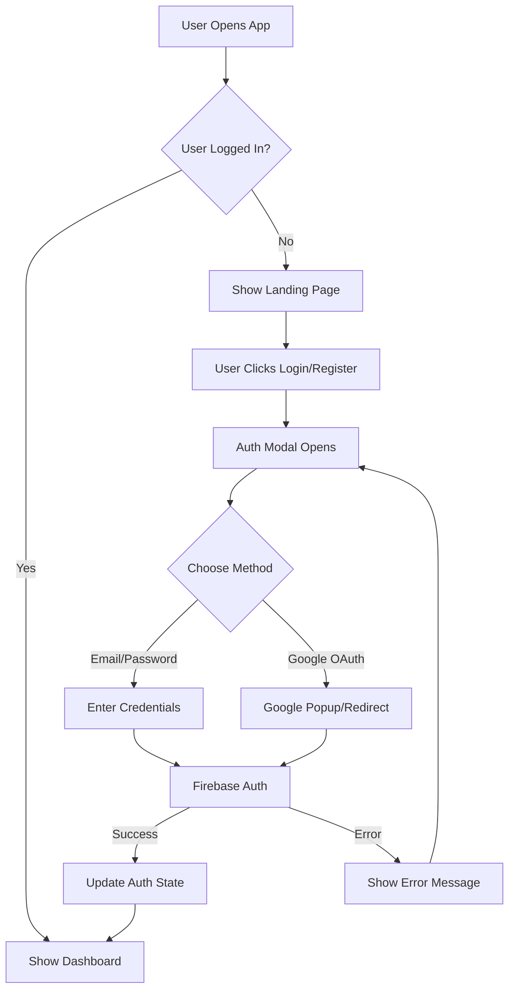

# Authentication System

## Overview

Collectr uses Firebase Authentication for secure user management with support for email/password and Google OAuth sign-in. The system is designed with development-first approach using Firebase emulators for local development.

## Features

### 🔐 Authentication Methods
- **Email/Password**: Standard registration and login
- **Google OAuth**: Single sign-on with Google accounts
- **Password Reset**: Email-based password recovery

### 🛡️ Security Features
- **Session Management**: Automatic token refresh and validation
- **Protected Routes**: Context-based route protection
- **Error Handling**: Comprehensive error messages and recovery
- **Input Validation**: Client-side form validation

### 🎨 User Experience
- **Modal Interface**: Clean, accessible authentication modals
- **Loading States**: Visual feedback during authentication
- **Success/Error Notifications**: Clear user feedback
- **Responsive Design**: Mobile-friendly forms

## Architecture

### Components Structure
```
/src/contexts/
  AuthContext.tsx           # Main authentication context
/src/components/auth/
  AuthModal.tsx            # Modal container for auth forms
  LoginForm.tsx            # Login form with email/password + Google
  RegisterForm.tsx         # Registration form with validation
/src/components/layout/
  Header.tsx               # User menu and auth buttons
/src/lib/
  firebase.ts              # Firebase configuration and emulator setup
```

### Authentication Flow



## Development Setup

### Prerequisites
- Node.js 20+ (18.20.5+ works but shows warnings)
- Java 11+ for Firebase emulators
- Firebase CLI installed globally

### Environment Configuration

1. **Install Firebase CLI**:
   ```bash
   npm install -g firebase-tools
   ```

2. **Set Java Environment** (macOS with Homebrew):
   ```bash
   export JAVA_HOME="/opt/homebrew/opt/openjdk@11"
   export PATH="$JAVA_HOME/bin:$PATH"
   ```

3. **Environment Variables** (`.env.local`):
   ```env
   # Firebase Configuration for Development
   NEXT_PUBLIC_FIREBASE_API_KEY=demo-api-key
   NEXT_PUBLIC_FIREBASE_AUTH_DOMAIN=demo-collectr.firebaseapp.com
   NEXT_PUBLIC_FIREBASE_PROJECT_ID=demo-collectr
   NEXT_PUBLIC_FIREBASE_STORAGE_BUCKET=demo-collectr.firebasestorage.app
   NEXT_PUBLIC_FIREBASE_MESSAGING_SENDER_ID=998912996227
   NEXT_PUBLIC_FIREBASE_APP_ID=demo-app-id
   
   # API Configuration
   NEXT_PUBLIC_API_BASE_URL=http://localhost:3001
   NEXT_PUBLIC_ENVIRONMENT=development
   ```

### Firebase Emulator Setup

1. **Start Emulators**:
   ```bash
   # From project root
   firebase emulators:start
   ```

2. **Emulator Endpoints**:
   - **Auth**: http://127.0.0.1:9099
   - **Firestore**: http://127.0.0.1:8080
   - **Storage**: http://127.0.0.1:9199
   - **UI Dashboard**: http://127.0.0.1:4000

3. **Start Development Server**:
   ```bash
   # In separate terminal
   pnpm --filter @collectr/web dev
   ```

### Development Workflow

1. **Start Services**:
   ```bash
   # Terminal 1: Firebase Emulators
   firebase emulators:start
   
   # Terminal 2: Web Development Server
   pnpm --filter @collectr/web dev
   ```

2. **Access Application**:
   - **Web App**: http://localhost:3001
   - **Firebase UI**: http://127.0.0.1:4000

3. **Testing Authentication**:
   - Use any email/password combination (emulator accepts all)
   - Google OAuth works with real Google accounts in emulator mode
   - Password reset emails appear in Firebase UI

## API Reference

### AuthContext

```typescript
interface AuthContextType {
  user: User | null;                    // Current user or null
  loading: boolean;                     // Auth state loading
  signIn: (email: string, password: string) => Promise<void>;
  signUp: (email: string, password: string, displayName?: string) => Promise<void>;
  signInWithGoogle: () => Promise<void>;
  logout: () => Promise<void>;
  resetPassword: (email: string) => Promise<void>;
}
```

### Usage Examples

#### Basic Auth Check
```typescript
import { useAuth } from '../contexts/AuthContext';

function MyComponent() {
  const { user, loading } = useAuth();

  if (loading) return <div>Loading...</div>;
  if (!user) return <div>Please log in</div>;

  return <div>Welcome, {user.displayName || user.email}!</div>;
}
```

#### Sign In
```typescript
const { signIn } = useAuth();

const handleLogin = async (email: string, password: string) => {
  try {
    await signIn(email, password);
    // User is now logged in
  } catch (error) {
    console.error('Login failed:', error);
  }
};
```

#### Protected Route
```typescript
import { useAuth } from '../contexts/AuthContext';
import { useRouter } from 'next/navigation';
import { useEffect } from 'react';

function ProtectedPage() {
  const { user, loading } = useAuth();
  const router = useRouter();

  useEffect(() => {
    if (!loading && !user) {
      router.push('/');
    }
  }, [user, loading, router]);

  if (loading) return <div>Loading...</div>;
  if (!user) return null;

  return <div>Protected content</div>;
}
```

## Error Handling

### Common Error Codes

| Code | Description | User Message |
|------|-------------|--------------|
| `auth/user-not-found` | No account exists | "No account found with this email address." |
| `auth/wrong-password` | Incorrect password | "Incorrect password." |
| `auth/invalid-email` | Malformed email | "Invalid email address." |
| `auth/email-already-in-use` | Email taken | "An account with this email already exists." |
| `auth/weak-password` | Password too weak | "Password is too weak. Please choose a stronger password." |
| `auth/popup-blocked` | Popup blocked | "Pop-up was blocked. Please enable pop-ups and try again." |
| `auth/network-request-failed` | Network error | "Network error. Please check your connection and try again." |

### Error Handling Pattern
```typescript
try {
  await signIn(email, password);
} catch (error: any) {
  const message = getErrorMessage(error.code);
  setError(message);
}

const getErrorMessage = (errorCode: string): string => {
  switch (errorCode) {
    case 'auth/user-not-found':
      return 'No account found with this email address.';
    // ... more cases
    default:
      console.error('Unhandled auth error:', errorCode);
      return 'An error occurred. Please try again.';
  }
};
```

## Security Rules

### Firestore Rules
```javascript
rules_version = '2';
service cloud.firestore {
  match /databases/{database}/documents {
    // Users can read and write their own user document
    match /users/{userId} {
      allow read, write: if request.auth != null && request.auth.uid == userId;
    }
    
    // Users can read and write their own games
    match /users/{userId}/games/{gameId} {
      allow read, write: if request.auth != null && request.auth.uid == userId;
    }
    
    // Public game data (read-only)
    match /games/{gameId} {
      allow read: if true;
      allow write: if false;
    }
    
    // User profiles (public read, owner write)
    match /profiles/{userId} {
      allow read: if true;
      allow write: if request.auth != null && request.auth.uid == userId;
    }
  }
}
```

### Storage Rules
```javascript
rules_version = '2';
service firebase.storage {
  match /b/{bucket}/o {
    // Users can upload and read their own files
    match /users/{userId}/{allPaths=**} {
      allow read, write: if request.auth != null && request.auth.uid == userId;
    }
    
    // Public game images (read-only)
    match /games/{allPaths=**} {
      allow read: if true;
      allow write: if false;
    }
  }
}
```

## Testing

### Manual Testing Checklist

#### Registration Flow
- [ ] Email/password registration works
- [ ] Display name is saved correctly
- [ ] Email validation prevents invalid emails
- [ ] Password validation enforces minimum length
- [ ] Duplicate email shows appropriate error
- [ ] Success state closes modal and logs user in

#### Login Flow
- [ ] Email/password login works
- [ ] Invalid credentials show appropriate error
- [ ] Remember user session across page refreshes
- [ ] Google OAuth login works (popup)
- [ ] Google OAuth fallback works (redirect)

#### Password Reset
- [ ] Password reset email is sent
- [ ] Success message is displayed
- [ ] Error shown for invalid email
- [ ] Reset email appears in Firebase UI

#### Session Management
- [ ] User stays logged in across page refreshes
- [ ] Logout clears session correctly
- [ ] Protected routes redirect when not authenticated
- [ ] User menu shows correct information

### Emulator Testing

1. **Create Test Account**:
   ```
   Email: test@collectr.dev
   Password: testpass123
   ```

2. **Test Google OAuth**:
   - Use real Google account
   - Emulator accepts any Google account
   - Check user data is populated correctly

3. **Test Password Reset**:
   - Enter email and request reset
   - Check Firebase UI for email
   - Verify reset link functionality

## Troubleshooting

### Common Issues

#### Emulators Won't Start
```bash
# Check Java installation
java -version

# Set correct Java path
export JAVA_HOME="/opt/homebrew/opt/openjdk@11"

# Clear emulator data
firebase emulators:start --clear
```

#### Google OAuth Popup Blocked
- Enable popups for localhost:3001
- System automatically falls back to redirect
- Check browser console for specific errors

#### Connection Refused Errors
- Ensure emulators are running
- Check ports aren't blocked: 9099, 8080, 9199, 4000
- Verify environment variables are set correctly

#### TypeScript Errors
```bash
# Check types
pnpm --filter @collectr/web type-check

# Fix import order
pnpm --filter @collectr/web lint --fix
```

### Debug Mode

Enable debug logging:
```typescript
// In firebase.ts, add:
if (process.env.NODE_ENV === 'development') {
  console.log('Firebase Auth Debug Mode Enabled');
  // Additional logging already included
}
```

## Production Setup

### Firebase Project Configuration

1. **Create Firebase Project**:
   - Go to [Firebase Console](https://console.firebase.google.com)
   - Create new project
   - Enable Authentication, Firestore, Storage

2. **Configure Authentication Providers**:
   - Enable Email/Password authentication
   - Configure Google OAuth with proper domain
   - Set up authorized domains

3. **Environment Variables**:
   ```env
   # Production Firebase config
   NEXT_PUBLIC_FIREBASE_API_KEY=your_api_key
   NEXT_PUBLIC_FIREBASE_AUTH_DOMAIN=your_project.firebaseapp.com
   NEXT_PUBLIC_FIREBASE_PROJECT_ID=your_project_id
   NEXT_PUBLIC_FIREBASE_STORAGE_BUCKET=your_project.firebasestorage.app
   NEXT_PUBLIC_FIREBASE_MESSAGING_SENDER_ID=your_sender_id
   NEXT_PUBLIC_FIREBASE_APP_ID=your_app_id
   NEXT_PUBLIC_ENVIRONMENT=production
   ```

### Deployment Checklist

- [ ] Firebase project created and configured
- [ ] Production environment variables set
- [ ] Security rules deployed
- [ ] Custom email templates configured
- [ ] Domain authorization updated
- [ ] SSL certificate configured
- [ ] Authentication flow tested in production

---

**Last Updated**: August 23, 2025  
**Version**: 2.0  
**Status**: ✅ Complete and Tested